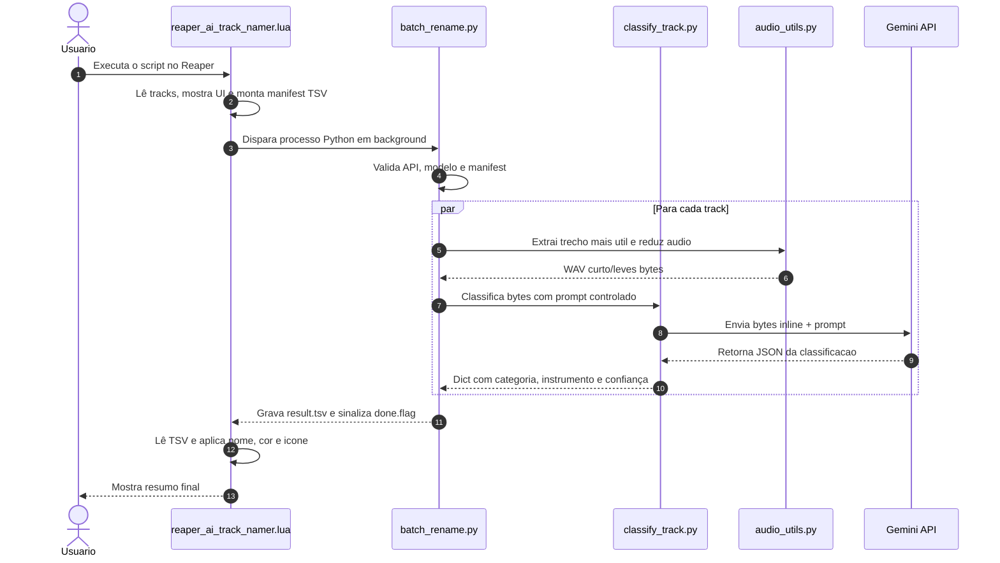

# Analise Completa do Projeto Reaper AI Track Namer

Este arquivo consolida uma leitura tecnica completa do repositorio, com foco no que o codigo realmente faz, como os modulos se conectam, quais sao as decisoes de arquitetura, onde estao os pontos de falha e como o fluxo inteiro termina no Reaper.

O objetivo aqui e servir como documento unico de referencia. A leitura foi feita diretamente no codigo fonte, entao este texto descreve o comportamento efetivo do projeto, nao apenas a intencao documental.

---

## 1. O que o projeto resolve

O projeto automatiza a identificacao de faixas de audio dentro do Reaper usando Gemini. Em vez de o usuario renomear manualmente centenas de tracks, o sistema tenta descobrir qual e o instrumento principal de cada faixa, aplica um nome mais util, pinta a track com uma cor coerente e, quando possivel, atribui um icone visual.

O problema central nao e apenas classificar audio. O problema real e integrar essa classificacao a um fluxo de DAW sem travar a interface, sem depender de bibliotecas pesadas dentro do Reaper e sem enviar audio desnecessario para a API.

Por isso a arquitetura foi separada em tres camadas:

1. Lua/ReaScript dentro do Reaper para coletar tracks, mostrar UI e aplicar o resultado.
2. Python para orquestrar processamento, I/O, threads e chamadas ao Gemini.
3. DSP local em NumPy/SoundFile para cortar audio curto e leve antes de chamar a IA.

---

## 2. Visao geral da arquitetura

O repositorio gira em torno de quatro responsabilidades principais:

- captura de contexto no Reaper;
- reducao do audio para um trecho representativo;
- classificacao via Gemini com fallback de modelos;
- aplicacao visual do resultado na track.

### Fluxo de alto nivel



---

## 3. Estrutura real do repositorio

Arquivos centrais e o papel de cada um:

- [reaper_ai_track_namer.lua](reaper_ai_track_namer.lua): ponte principal com o Reaper, UI, coleta de tracks, geracao de manifest, polling de progresso e aplicacao de resultado.
- [batch_rename.py](batch_rename.py): orquestrador em lote que le o manifest, distribui as tarefas em threads, chama a IA e escreve o TSV final.
- [classify_track.py](classify_track.py): motor de classificacao, prompt do Gemini, fallback de modelos, parsing de JSON e logica de classificacao de um unico audio.
- [audio_utils.py](audio_utils.py): utilitarios locais de audio, principalmente extracao do trecho de maior energia, downmix e resample.
- [test_batch.py](test_batch.py): valida a acuracia da classificacao contra um gabarito local.
- [analysis_prompt.txt](analysis_prompt.txt): prompt externo que pode substituir o prompt padrao embutido em classify_track.py.
- [setup.bat](setup.bat): inicializacao do ambiente Python e criacao do .env.

Os documentos [README.md](README.md), [README_ARCHITECTURE.md](README_ARCHITECTURE.md) e [README_IAS.md](README_IAS.md) sao complementares, mas esta analise prioriza o comportamento observado no codigo.

---

## 4. Caminho completo de execucao

### 4.1. Entrada do usuario no Reaper

O ponto de partida e o script Lua. Ele abre uma interface grafica customizada com:

- escolha de apenas tracks selecionadas ou todas;
- modo rapido ou detalhado;
- numero de threads;
- prompt customizado de cores;
- chave da API Gemini;
- botao para mostrar/ocultar a chave;
- seletor de idioma EN/PT.

Quando o usuario confirma, o script valida os campos, salva a chave no `.env` se necessario e inicia o processamento.

### 4.2. Coleta de tracks e montagem do manifest

Para cada track do projeto, o Lua verifica se ela entra no escopo de analise. O default e analisar todas, mas existe a opcao de filtrar apenas as selecionadas.

Depois ele percorre os media items da track e escolhe o item mais representativo, definido na pratica como o de maior duracao usada. O codigo usa:

- `D_LENGTH` do item;
- `D_PLAYRATE` da take;
- `D_STARTOFFS` para saber onde a janela comeca dentro do arquivo-fonte.

Essa escolha e importante: se uma track tem varios cortes do mesmo audio, o sistema tenta pegar a instancia mais informativa, nao apenas o primeiro item encontrado.

O resultado e um arquivo TSV temporario com linhas do tipo:

`idx<TAB>caminho_do_audio<TAB>inicio_segundos<TAB>duracao_segundos`

### 4.3. Disparo do backend Python

O Lua descobre o Python do `venv` local quando existe; caso contrario, cai para `python` ou `python3` do sistema. Depois roda `batch_rename.py` em background, redirecionando stdout/stderr para um log temporario.

Enquanto isso, o Reaper nao fica bloqueado. O script usa `reaper.defer()` para fazer polling periodico:

- do arquivo de log;
- do arquivo `done.flag`;
- do timeout de seguranca.

Essa escolha e essencial para a experiencia de uso, porque evita travar a UI da DAW durante chamadas de rede e processamento de audio.

### 4.4. Classificacao por track

O backend Python le o manifest e distribui cada track em uma thread. Para cada entrada:

1. identifica o audio fonte;
2. extrai um trecho curto representativo;
3. converte o trecho para uma forma leve;
4. chama o Gemini como bytes inline;
5. recebe JSON com categoria, instrumento e confiança;
6. escreve a linha final no TSV.

### 4.5. Aplicacao do resultado

Quando o TSV final esta pronto, o Lua le cada linha, cruza o `idx` com os metadados que ele guardou em memoria e aplica:

- novo nome da track;
- cor da track;
- icone, se encontrar um arquivo correspondente nos icones do Reaper.

Isso tudo e feito dentro de um bloco de undo, para que o usuario possa reverter a operacao de forma unica.

---

## 5. Analise por modulo

## 5.1. [audio_utils.py](audio_utils.py)

Este modulo e a base de eficiencia do projeto. Ele reduz o audio antes da IA ver o arquivo.

### `_read_audio(path)`

Le o arquivo com `soundfile`. Se falhar, tenta converter com `ffmpeg` para WAV temporario e ler de novo. Isso e importante porque o `libsndfile` nao cobre todos os formatos em todas as instalacoes.

O comportamento real e:

- tentar leitura direta;
- se falhar, criar um WAV temporario;
- chamar `ffmpeg -y -i <arquivo> -ar 44100 <tmp.wav>`;
- ler o WAV convertido;
- limpar o temporario no fim.

### `extract_best_segment(...)`

Funcao central para cortes.

O algoritmo faz o seguinte:

1. carrega o audio inteiro;
2. opcionalmente restringe a busca a uma janela do arquivo original;
3. calcula energia em janelas deslizantes com `cumsum` sobre o sinal mono;
4. encontra a janela com maior energia media;
5. grava apenas esse trecho em `out_path`;
6. retorna o caminho e o tempo absoluto do inicio do segmento.

#### Porque isso importa

Em stems longos, ha muito silencio no inicio, no fim ou entre entradas. Mandar o arquivo inteiro para a IA seria mais caro, mais lento e menos preciso. O corte por energia procura a parte onde realmente ha informacao musical.

#### Complexidade pratica

O uso de soma cumulativa evita recalcular energia do zero para cada janela. O custo principal fica na varredura linear do audio, o que e aceitavel mesmo em arquivos longos.

### `downmix_resample(...)`

Transforma o trecho em uma versao mais leve:

- converte para mono, a menos que `keep_stereo` seja explicitamente usado;
- resampleia para `target_sr=24000` por interpolacao linear;
- grava como WAV PCM 16-bit.

Este ponto merece destaque: o codigo atual trabalha com **24 kHz**, nao 16 kHz. Isso e uma escolha deliberada para preservar mais harmonicos uteis na classificacao.

### `extract_three_peaks(...)`

Usada no modo rapido do lote. Em vez de um unico trecho, extrai tres blocos de 4 segundos em regioes de maior energia dentro da janela do item e concatena tudo.

Na pratica, isso cria uma amostra mais abrangente sem mandar o arquivo inteiro.

### `remove_all_silence(...)`

Usada no modo detalhado. Ela remove blocos silenciosos e preserva apenas regioes ativas do audio. Quando quase tudo e silencio, mantém pelo menos um segundo no inicio para evitar arquivo vazio.

### `convert_to_mp3_128k(...)`

Tenta converter o WAV para MP3 128 kbps com `ffmpeg`. Se uma variante falhar, tenta uma segunda chamada mais simples.

Essa funcao existe para o modo rapido do lote, onde o tamanho do payload interessa bastante.

### Conclusao do modulo

O `audio_utils.py` nao faz classificacao. Ele faz selecao inteligente de contexto musical. O projeto depende muito dessa camada, porque sem ela a IA veria audio demais e relevancia de menos.

---

## 5.2. [classify_track.py](classify_track.py)

Este modulo e o centro de decisao da classificacao.

### Vocabulario fechado

O sistema aceita apenas estas categorias:

`vocal, guitarra, baixo, bateria, teclado, synth, sopro, cordas, outro`

Isso reduz deriva semantica. O modelo continua livre para descrever o timbre em `instrument`, mas a categoria fica padronizada.

### Prompt padrao

O prompt embutido instrui o modelo a responder somente JSON valido, com campos:

- `instrument`;
- `category`;
- `confidence`;
- `notes`.

Ele tambem inclui heuristicas musicais para nao confundir bateria com instrumentos de corda percussivos, nem flauta/sopro com synths, nem texturas sem pitch com instrumentos definidos.

### `load_prompt()`

Procura um `analysis_prompt.txt` local. Se existir e tiver conteudo, ele substitui o prompt padrao. Isso permite iterar no comportamento da IA sem alterar o codigo.

### `MODELOS_FALLBACK`

Se a variavel `GEMINI_MODELS` existir no ambiente, ela define a ordem dos modelos. Caso contrario, o default atual e:

1. `gemini-3.5-flash`
2. `gemini-3.1-flash-lite`
3. `gemini-2.5-flash`

O comportamento esperado e tentar o primeiro, repetir se o erro for transitorio e, se continuar falhando, avançar para o proximo.

### `classify_track(...)`

Funcao principal para um audio completo, mas normalmente usada como etapa de suporte aos testes e ao batch.

Fluxo:

1. verifica se o arquivo existe;
2. extrai o melhor segmento;
3. gera a versao leve;
4. chama `classify_audio_bytes(...)`;
5. anexa metadados do trecho analisado;
6. opcionalmente preserva os temporarios para debug.

### `classify_audio(...)`

Versao simples que le bytes do arquivo original e chama a IA sem corte nem downsample. Ela existe por compatibilidade e debug, mas nao e o caminho ideal para audio grande.

### `classify_audio_bytes(...)`

Aqui esta o nucleo da classificacao.

O envio para o Gemini e feito com `types.Part.from_bytes`, ou seja, como bytes inline, sem upload separado de arquivo.

O fluxo de erro e importante:

- JSON invalido: registra erro de parse e vai para o proximo modelo;
- erro transitorio: tenta novamente com backoff exponencial;
- erro permanente: pula logo para o fallback seguinte.

Depois do parse, se a categoria vier fora do vocabulario esperado, o codigo nao aborta; ele apenas adiciona `_warning` no resultado.

### Saida real

A funcao devolve um dicionario Python. Em caso de sucesso, inclui:

- `instrument`;
- `category`;
- `confidence`;
- `notes`;
- `_segment_start_seconds`;
- `_segment_duration_seconds`;
- `_model_usado`.

Em caso de falha geral, devolve algo como:

`{"error": "todos os modelos falharam", "_erros_por_modelo": {...}}`

### Ponto importante de robustez

O arquivo nao tenta ser permissivo demais com a saida da IA. Ele prefere um contrato estrito e falha visivel em vez de aceitar texto solto e depois inferir estrutura.

---

## 5.3. [batch_rename.py](batch_rename.py)

Este modulo e o motor do processamento em lote.

### Entrada: manifest TSV

Le linhas no formato:

`idx<TAB>caminho_do_audio<TAB>inicio_segundos<TAB>duracao_segundos`

Se os tempos vierem vazios, o codigo aceita `None`.

### Saida: result TSV

Escreve linhas no formato:

`idx<TAB>status<TAB>categoria<TAB>instrumento<TAB>confianca<TAB>erro`

Isso e propositalmente simples para o Lua ler sem biblioteca extra.

### `SharedModelList`

A estrutura compartilhada e thread-safe para a lista de modelos.

Quando uma thread conclui que um modelo nao esta disponivel ou falhou de forma repetida, esse modelo pode ser removido da lista global para as proximas tracks nao insistirem no mesmo caminho ruim.

### `check_api_availability(...)`

Antes de processar o lote, o script testa se a API responde com algum dos modelos em ordem. Se a checagem inicial falhar, o sistema entra num modo de fallback universal.

### `process_one(...)`

Essa e a unidade de trabalho por track.

Ela escolhe o modo de processamento com base em `quality`:

- `alta`: remove silencios e envia WAV;
- `normal`: extrai tres picos, tenta MP3 128k, e se nao conseguir usa WAV leve.

Depois disso chama `classify_audio_bytes(...)` com a lista de modelos atual da thread.

### `generate_colors_ini(...)` e `handle_color_generation(...)`

O backend nao serve apenas para classificar audio. Ele tambem pode gerar uma paleta de cores customizada a partir de um prompt de estilo. O modelo e instruido a devolver um `.ini` com secao `[Cores]` e chaves especificas.

Isso significa que a IA tambem pode participar do design visual da DAW, nao apenas da classificacao sonora.

### `main()`

O fluxo final do lote e:

1. carregar `.env`;
2. validar `GEMINI_API_KEY`;
3. validar o manifest;
4. inicializar o cliente Gemini;
5. testar disponibilidade dos modelos;
6. opcionalmente gerar paleta de cores;
7. ler entries;
8. processar tudo em `ThreadPoolExecutor`;
9. gravar o resultado;
10. criar o `done.flag`.

### Importante sobre o paralelismo

Threads foram escolhidas porque o gargalo e rede/API, nao CPU. Isso faz sentido no caso deste projeto. Multiprocessamento so aumentaria custo de coordenacao.

### Limpeza de temporarios

Cada job cria arquivos temporarios e os remove no `finally`. Isso evita acúmulo de WAV/MP3 residual quando uma thread falha no meio.

---

## 5.4. [reaper_ai_track_namer.lua](reaper_ai_track_namer.lua)

Este e o modulo mais complexo do ponto de vista de produto, porque junta interface, persistencia, processamento de tracks e aplicacao visual.

### Estados da interface

O script opera em quatro estados:

- `config`;
- `analyzing`;
- `completed`;
- `error`.

Essa maquina de estados simplifica a UI sem precisar de uma biblioteca externa.

### Internacionalizacao

O idioma e salvo em `ExtState` do Reaper sob a chave `AiNOMEATOR/language`. Se nada estiver definido, o default e ingles.

### Configuracao de cores

O Lua carrega `reaper_ai_track_namer_colors.ini`. Se o arquivo nao existir, ele cria um com defaults.

Isso permite customizacao manual fora da IA, e tambem permite uma paleta customizada vinda do prompt de cores.

### Mapeamento de categoria para cor

O sistema nao usa apenas `category`. Ele tenta interpretar o contexto lexical do nome da track e do `instrument` retornado para refinar a escolha da cor.

Exemplos de regras:

- `vocal` + palavras de apoio -> `backing_vocals`;
- `bateria` + palavras de percussao -> `percussao`;
- `guitarra` + palavras de violao/acustico -> `violao`;
- `teclado` + palavras de synth -> `synth`.

Se a track for folder, a cor e forcada para `pastas`.

### Mapeamento de icones

O script varre `Data/track_icons` dentro do Resource Path do Reaper e procura arquivos cujo nome contenha palavras-chave por categoria.

Categorias cobertas:

- vocal;
- guitarra;
- baixo;
- bateria;
- teclado;
- synth;
- sopro;
- cordas.

Se nao encontrar, ele simplesmente nao define icone.

### Coleta de audio por track

O script percorre todos os items da track e escolhe o item de maior `used duration`. Essa duracao e calculada com `D_LENGTH * D_PLAYRATE`, o que e uma boa aproximacao do quanto daquele arquivo esta efetivamente em uso.

Se a track tiver MIDI ou takes sem audio, elas sao ignoradas para o manifest.

### Execucao do Python

No Windows, o comando e disparado em background com `start /B cmd /c ... > log 2>&1`.
Em outros sistemas, o script usa `&`.

Durante a execucao, o Lua vai lendo o log incrementalmente para mostrar progresso ao vivo.

### Polling e timeout

O polling confere:

- crescimento do arquivo de log;
- existencia do `done.flag`;
- tempo maximo de 300 segundos.

Se estourar timeout, o usuario recebe mensagem para examinar o log manualmente.

### Aplicacao do resultado

Quando o TSV final chega, o script:

1. reabre a config de cores;
2. lista os icones disponiveis;
3. inicia `Undo_BeginBlock`;
4. bloqueia refresh da UI;
5. percorre o TSV;
6. para cada sucesso, altera nome, cor e icone;
7. para tracks nao processadas, ainda aplica cor utilitaria, como `pastas` ou `efeitos` quando o nome sugere isso;
8. finaliza undo e atualiza arrange.

### UI customizada

A interface usa `gfx` e e totalmente desenhada na mao. Ela inclui:

- log em tempo real;
- botao de copiar logs;
- botao mostrar/ocultar API key;
- creditos clicaveis;
- seletor de idioma;
- botao de analise e botao de fechar.

### Persistencia da chave da API

A chave e lida do `.env` e tambem pode ser salva pela interface. O script atualiza a linha `GEMINI_API_KEY=` no arquivo.

Isso e pratico, mas tambem significa que o arquivo `.env` e um ponto sensivel do fluxo.

### Dependencia do SWS

O paste via Ctrl+V so funciona se a extensao SWS estiver disponivel, porque o script chama `reaper.CF_GetClipboard`.

Se nao estiver, ele exibe aviso e pede alternativa manual.

---

## 6. Contratos de dados

## 6.1. Manifest de entrada

Formato:

```tsv
idx    caminho_do_audio    inicio_segundos    duracao_segundos
```

Na pratica, nao ha cabecalho.

Campos:

- `idx`: indice 0-based da track no Reaper;
- `caminho_do_audio`: arquivo fonte;
- `inicio_segundos`: offset da janela usada dentro do arquivo fonte;
- `duracao_segundos`: duracao efetiva da janela.

## 6.2. Resultado de saida

Formato:

```tsv
idx    status    categoria    instrumento    confianca    erro
```

Regra de contrato:

- `ok` significa sucesso;
- `erro` significa falha isolada daquela track;
- campos textuais sao sanitizados para nao quebrar o parser TSV.

## 6.3. JSON interno da IA

O Gemini deve retornar JSON estrito, normalmente com:

- `instrument`;
- `category`;
- `confidence`;
- `notes`.

O codigo nao tenta aceitar texto misturado com JSON.

---

## 7. Modos de processamento

## 7.1. Modo rapido

Ativa tres picos de audio em blocos de 4 segundos, tentando usar MP3 128 kbps quando possivel.

Vantagens:

- menor payload;
- boa representatividade em sinais com partes esparsas;
- bom para lotes maiores.

Desvantagens:

- pode perder continuidade timbrica;
- se o audio tiver muita mudanca interna, tres blocos podem nao capturar tudo.

## 7.2. Modo detalhado

Remove silencios e envia WAV.

Vantagens:

- preserva mais informacao do audio real;
- tende a ser melhor para classificacao mais fina.

Desvantagens:

- payload maior;
- custo e latencia podem subir.

---

## 8. Estratégia de robustez e fallback

O projeto foi desenhado para sobreviver a falhas comuns da API e da plataforma.

### Falhas tratadas

- modelo descontinuado (`404`);
- sobrecarga temporaria (`503`);
- rate limit (`429`);
- timeouts;
- JSON invalido;
- ausencia de `.env`;
- falta de arquivo de audio;
- formatos de audio nao suportados diretamente;
- ausencia de `venv`.

### Como o sistema reage

- tenta novamente quando faz sentido;
- passa para outro modelo quando um falha;
- salva logs detalhados;
- evita quebrar o lote inteiro por erro de uma track;
- informa o usuario quando nao consegue concluir.

Essa abordagem e boa para uso real em DAW, porque uma sessao pode ter dezenas de tracks, e travar tudo por uma faixa ruim seria inaceitavel.

---

## 9. Pontos fortes reais do projeto

1. O processamento pesado nao acontece dentro do Reaper.
2. O audio e reduzido antes da chamada de IA.
3. O lote roda em paralelo.
4. O resultado e aplicado de forma atomica com undo.
5. O sistema permite iterar no prompt sem mexer no fluxo.
6. A saida e estruturada para facilitar manutencao.
7. Ha fallback de modelos, o que e crucial para estabilidade com Gemini.
8. O usuario consegue depurar pelo log sem abrir ferramentas extras.

---

## 10. Riscos e limitacoes

### 10.1. Dependencia externa de API

Se o Gemini estiver indisponivel, o sistema continua funcionando como app, mas nao como classificador.

### 10.2. Qualidade da classificacao depende do audio de entrada

Se a track estiver mal gravada, com muito bleed ou com instrumentacao ambigua, o modelo pode errar mesmo com prompt bom.

### 10.3. A heuristica de escolher o item mais longo pode nao ser perfeita

Em alguns projetos, o item mais longo nao e necessariamente o mais representativo musicalmente. O sistema assume que isso e bom o suficiente para a maioria dos casos.

### 10.4. Os mapeamentos de icone sao best-effort

Se os nomes dos arquivos de icone do Reaper mudarem, a correspondencia pode falhar sem quebrar o restante do fluxo.

### 10.5. O parser TSV depende de sanitizacao correta

O codigo ja substitui tabs e quebras de linha em erros, mas qualquer mudanca nesse contrato precisa ser feita com cuidado.

### 10.6. A paleta de cores pode ser sobrescrita por prompt customizado

Isso e desejado, mas tambem significa que o usuario pode gerar configuracoes incoerentes se o prompt for ruim.

---

## 11. O que cada arquivo acrescenta ao sistema

### [setup.bat](setup.bat)

Inicializa o ambiente de execucao. Ele cria o `venv`, instala dependencias e prepara o `.env`.

### [requirements.txt](requirements.txt)

Define o conjunto minimo de bibliotecas externas:

- `google-genai`;
- `python-dotenv`;
- `numpy`;
- `soundfile`.

### [analysis_prompt.txt](analysis_prompt.txt)

E a forma mais facil de alterar o comportamento da classificacao sem editar codigo. O script o usa se ele existir.

### [test_batch.py](test_batch.py)

Funciona como mini-suite de validacao. Ele nao mede apenas se o codigo roda; ele mede se o prompt esta acertando o vocabulario esperado.

---

## 12. Sequencia operacional resumida

1. O usuario abre o script no Reaper.
2. A UI mostra modo, threads, prompt de cores e chave API.
3. O Lua varre tracks e monta o manifest.
4. O Python recebe o manifest.
5. O Python extrai o trecho mais util do audio.
6. O trecho e reduzido e enviado ao Gemini.
7. A resposta e convertida em JSON estruturado.
8. O TSV de saida e gravado.
9. O Lua aplica nome, cor e icone.
10. O usuario ve o resumo final e pode desfazer tudo em um unico undo.

---

## 13. Onde o projeto pode evoluir

Se for mexer neste repositorio, os pontos mais naturais de evolucao sao:

- melhorar a heuristica de selecao do trecho;
- adicionar metrificacao de acuracia por categoria;
- registrar historico de modelos usados e taxas de erro;
- tornar o mapeamento de icones mais configuravel;
- expandir o conjunto de categorias;
- adicionar uma camada de cache local para reduzir chamadas repetidas.

Mas qualquer mudanca desse tipo precisa preservar a divisao atual: Reaper coleta, Python orquestra, audio_utils reduz, classify_track fala com a IA.

---

## 14. Conclusao tecnica

O projeto nao e apenas um script de renomeacao. Ele e um pipeline completo de organizacao automatica de tracks, construido para funcionar dentro das restricoes reais do Reaper e das limitacoes da API Gemini.

O desenho geral e coerente:

- usa Lua apenas para a parte que precisa estar no Reaper;
- joga processamento pesado para Python;
- reduz o audio antes de chamar a IA;
- faz a classificacao com fallback robusto;
- aplica a saida visualmente de forma integrada;
- e mantém um contrato de dados simples e legivel em TSV.

Em termos praticos, a qualidade do sistema depende de tres coisas: bom prompt, bom recorte de audio e boa estrategia de fallback. O codigo atual cobre essas tres frentes de forma consistente.
