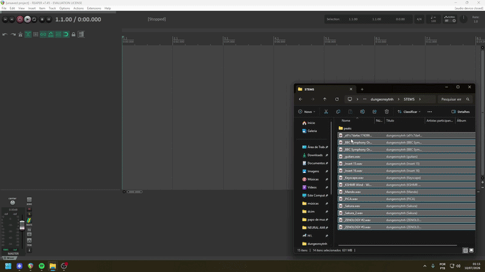
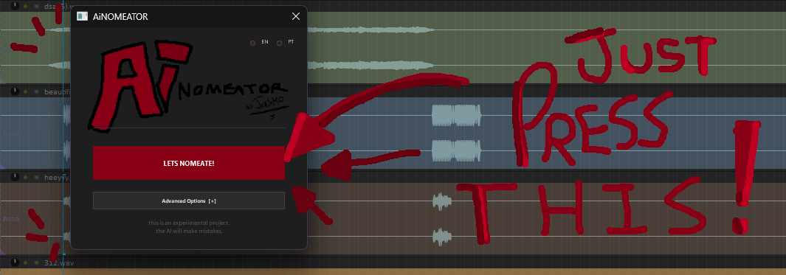

<div align="center">
  

  [](LICENSE)
  [](https://github.com/pontojasko/ReaperAiNOMEATOR/stargazers)
  [](https://github.com/pontojasko/ReaperAiNOMEATOR/issues)

  **Have you ever had to export stems from your FL Studio or Ableton project into Reaper, only to find yourself dreading the tedious process of organizing and renaming dozens of messy tracks?**

  Automatically identify, rename, and colorize your Reaper tracks using AI

  [Getting Started](#getting-started)

  <br />
  
  <br />
  <em>Demo — names, colors and icons applied automatically by AI</em>
</div>

---

## Overview

> [!WARNING]
> This is an experimental project. The AI models under the hood can still make mistakes. We warmly welcome any suggestions, feedback, or pull requests to help improve the classification pipelines!

---

## Getting Started
### Prerequisites

- **Python 3.9+**.
- *(Optional)* Gemini API Key.
- *(Optional)* SWS Extension for color synchronization.

### Installation

1. Clone or download this repository to a local folder.
2. Add `AiNOMEATOR.lua` to your Reaper Actions list (**Actions > Show action list > New action > Load ReaScript**).
3. Run "setup.bat"

### Configuration

You just have to configure your API key in .env if you want gemini or hybrid analysis.

```env
GEMINI_API_KEY=your_google_beautiful_secret_really_hyper_google_secret_api_key_here_just_in_case
```
---

## Usage
### Quick Execution
When you launch `AiNOMEATOR.lua` in Reaper, you will be greeted by a simple interface:

<p align="center">
  
  <br />
  <em>Compact Mode</em>
</p>


- **LETS NOMEATE!**: Main thing here
- **EN / PT**: Toggle between English and Portuguese localization for the UI and generated names/colors.
- **[Advanced Options [+]](https://github.com/pontojasko/ainomeator/tree/main#advanced-options)**: Click to expand the window and have fun with advanced features.

---

### Advanced Options

Expanding the settings panel allows you to customize the underlying AI models and performance options:

<p align="center">
  
  &nbsp;&nbsp;&nbsp;&nbsp;
  
  <br />
  <em>Left: Advanced Options Panel &nbsp;&nbsp;&nbsp;&nbsp;|&nbsp;&nbsp;&nbsp;&nbsp; Right: Analysis Status</em>
</p>

#### Some tips

- **Analysis Mode**: **Detailed** is still a pretty fast option.
- **Analysis Backend**: start with **PANNs** as your baseline. You can also test Gemini or a hybrid solution if you are working with synth-based music or want to explore another results.
- **Local Threads**: **the.more.the.merrier**

---

## Troubleshooting

> [!NOTE]
> If Reaper reports no results, ensure that `setup.bat` was run, the `.env` file exists with your key, and Python is accessible in your PATH.

- **503 / 429 Errors**: Gemini might return temporary rate limit errors. Reduce the parallel threads setting in the GUI.
- **Invalid Python Path**: Ensure you restart Reaper or your computer after adding Python to your system PATH.
  
---

## License
This project is licensed under the GNU General Public License v3.0 - see the [LICENSE](https://github.com/pontojasko/ainomeator/blob/main/LICENSE) file for details.

You can also read more about the license at the [official GNU website](https://www.gnu.org/licenses/gpl-3.0.html).
