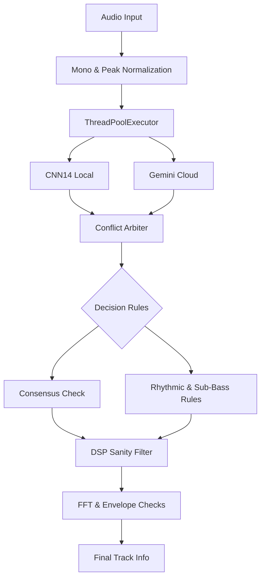

<div align="center">
  

  [](LICENSE)
  [](https://github.com/pontojasko/ReaperAiNOMEATOR/stargazers)
  [](https://github.com/pontojasko/ReaperAiNOMEATOR/issues)

  **Have you ever had to export stems from your FL Studio or Ableton project into Reaper, only to find yourself dreading the tedious process of organizing and renaming dozens of messy tracks?**

  Automatically identify, rename, and colorize your Reaper tracks using AI

  [Getting Started](#getting-started) · [Architecture](#architecture--features) · [Report Bug](https://github.com/pontojasko/ReaperAiNOMEATOR/issues)

  <br />
  
  <br />
  <em>Demo — names, colors and icons applied automatically by AI</em>
</div>

---

## Overview

> [!WARNING]
> **Note:** This is an experimental project. The AI models under the hood can still make mistakes. We warmly welcome any suggestions, feedback, or pull requests to help improve the classification pipelines!

Exporting stems from modern DAWs or receiving poorly named tracks from clients usually means spending hours manually renaming, coloring, and organizing the session before you can even start mixing.

AI Nomeator offloads this heavy lifting to a background AI processor. By utilizing a hybrid model approach (combining local CNNs and cloud-based Gemini), it accurately identifies the instruments playing in each stem and automatically organizes your entire Reaper project.

A fully structured, color-coded, and properly named Reaper session ready for mixing in minutes, saving you hours of tedious administrative work.

---

## Getting Started
### Prerequisites

- **Python 3.9+**.
- **Free Gemini API Key**.
- *(Optional)* SWS Extension for color synchronization.

### Installation

1. Clone or download this repository to a local folder.
2. Add `AiNOMEATOR.lua` to your Reaper Actions list (**Actions > Show action list > New action > Load ReaScript**).
3. Run "setup.bat"

### Configuration

You must configure your API key if you want to run gemini or hybrid analysis.

```env
GEMINI_API_KEY=your_api_key_here
```
---

## Usage
- **Analysis Backend**: start with **PANNs** as your baseline. It is generally the most fast starting point. You can also test Gemini or a hybrid solution if you want to explore another/better results.
- **Analysis Mode**: use **Detailed**.
- **Parallel Tracks**: with Gemini, keep the thread count `1` to avoid rate limits .

---

## Architecture & Features

The **Hybrid** backend relies on a triple-layer logic to prevent AI hallucinations and misclassifications:



1. **Parallel Execution Layer**: Both CNN14 and Gemini run concurrently, providing both spectral and semantic classification models in memory before making a decision.
2. **Conflict Arbiter**: 
   - *Rhythmic Priority*: If CNN14 detects a vocal but Gemini detects a shaker, the Arbiter overrides to shaker (Gemini excels at identifying high-frequency fricatives).
   - *Bass Transient*: If Gemini detects a piano but CNN14 detects bass or strings, it is classified as a bass (CNN14 recognizes low-frequency bodies better).
3. **DSP Sanity Filter**: Runs FFT and envelope checks locally.
   - Blocks vocal/piano tags if the main energy concentration is below 100Hz, forcing a bass/kick classification.
   - Forces a percussion classification if the sound has abrupt decays and no sustain.

### Audio Processing

Audio is locally converted to mono, peak-normalized, reduced to a higher-energy segment, and resampled to 24 kHz (or 16/32 kHz depending on the local model) before any AI processing occurs. This ensures low latency, reduced costs, and minimal context noise.

### Color Customization & SWS Sync

Edit `colors.ini` manually (format `key = #HEX`) or use the color prompt field in the GUI to generate a palette via AI. The AI-generated file is saved as `colors_prompt.ini`.
If you use the **SWS Extension**, run `AiNOMEATOR_sws_sync.lua` in Reaper (or `sync_sws_colors.bat` outside) to instantly copy the AiNOMEATOR palette to Reaper's native `sws-autocoloricon.ini`.

---

## Troubleshooting

> [!NOTE]
> If Reaper reports no results, ensure that `setup.bat` was run, the `.env` file exists with your key, and Python is accessible in your PATH.

- **503 / 429 Errors**: Gemini might return temporary rate limit errors. Reduce the parallel threads setting in the GUI.
- **Invalid Python Path**: Ensure you restart Reaper or your computer after adding Python to your system PATH.
