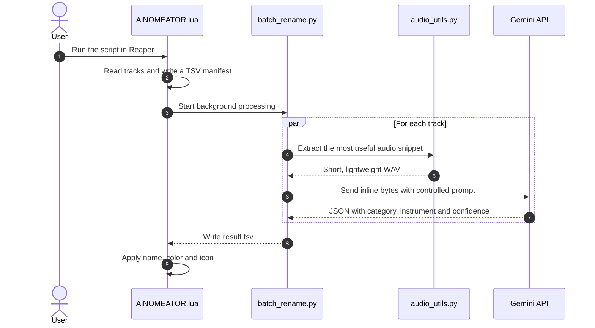
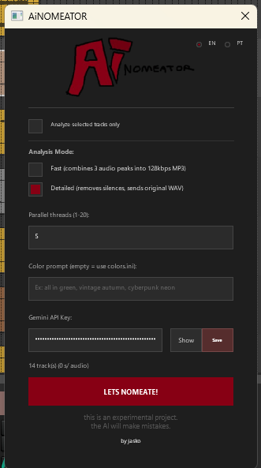

<p align="center">
  
</p>

# AiNOMEATOR

Automatically identifies the primary instrument of each track in Reaper using Gemini, then applies a name, color and icon — with a GUI and background processing that keeps the DAW responsive.

> [!CAUTION]
> **Experimental project.** This is a work-in-progress with plenty of bugs and rough edges. The current default model (Gemini Flash-Lite) frequently confuses instruments — expect misclassifications, especially with similar-sounding tracks. You can try to improve accuracy by editing the prompt in `analysis_prompt.txt` and selecting a better model via `--models` or the GUI settings.

## Overview



The pipeline prioritizes short, representative snippets to reduce cost, latency and context noise. Audio is locally converted to mono, peak-normalized, reduced to a higher-energy segment and resampled to 24 kHz (or 16/32 kHz depending on the local model) before any AI processing.

## Key features

- **Peak Normalization & Mono downmix** applied locally before any AI processing.
- **Concurrent local CNN14/PANNs and cloud Gemini** execution in the Hybrid backend.
- **Smart Conflict Arbiter** to cross-examine classification outputs.
- **DSP Sanity Checks (FFT and envelope)** to automatically override errors.
- **Automatic track sorting** by instrument family (guitars on top, followed by keys, synths, bass, drums, vocals, etc.).
- Single-file or batch audio classification.
- Reaper GUI (EN/PT) with real-time progress.
- Reaper integration without blocking the UI.
- Parallelism using `ThreadPoolExecutor` for API calls (I/O-bound).
- Automatic Gemini model fallback when a model fails or becomes unavailable.
- Customizable color palette via `.ini` file or AI prompt.
- Optional SWS Auto Color synchronization.
- Standardized TSV output to ease exchange between Lua and Python.
- Local validation tools with `test_single.bat` and `test_batch.bat` before using inside the DAW.

## Screenshots

<p align="center">
  
  <br />
  <em>Script interface — analysis settings, colors and API key</em>
</p>

<p align="center">
  
  <br />
  <em>Demo — names, colors and icons applied automatically by AI</em>
</p>

## Requirements

- Python 3.9+ in PATH
- A Gemini API key
- Reaper for the integration step with `AiNOMEATOR.lua`
- SWS Extension (optional, for Ctrl+V paste and color sync)

> [!TIP]
> If you only want to test the AI first, you don't need to open Reaper. Use `classify_track.py` and `test_batch.py` with sample files in `samples/`.

## Installation

### Option A — Install via ReaPack (recommended)

1. Make sure [ReaPack](https://reapack.com/) is installed in Reaper.
2. Go to **Extensions > ReaPack > Manage repositories**.
3. Click **Import repositories** (or right-click the list > **Import a repository**).
4. Paste this URL:

```
https://raw.githubusercontent.com/pontojasko/ReaperAiNOMEATOR/main/index.xml
```

5. Click **OK** and then **Synchronize packages**.
6. Browse to **AiNOMEATOR** in the ReaPack browser and install `AiNOMEATOR.lua` (and optionally `AiNOMEATOR_sws_sync.lua`).
7. After installation, you still need to set up the Python backend:
   - Open the REAPER resource path (**Options > Show REAPER resource path**).
   - Navigate to `Scripts/AiNOMEATOR/`.
   - Run `setup.bat` to create the venv and `.env` file.
   - Open `.env` and set your key:

```env
GEMINI_API_KEY=put_your_key_here
```

> [!IMPORTANT]
> ReaPack installs only the Lua scripts. The Python backend (`batch_rename.py`, `classify_track.py`, `audio_utils.py`, etc.) must be present in the same folder. Run `setup.bat` after installing via ReaPack.

The key can also be entered directly in the script's GUI inside Reaper.

### Option B — Manual installation

1. Extract the repository to a local folder, e.g. `C:\reaper-ainomeator`.
2. Run `setup.bat`.
   - It creates the virtual environment.
   - It installs dependencies.
   - It creates a `.env` file at the project root.
3. Open `.env` and set your key:

```env
GEMINI_API_KEY=put_your_key_here
```

The key can also be entered directly in the script's GUI inside Reaper.

## How it works

### Step 1: Reaper gathers context

The ReaScript scans project tracks, finds the most representative media item and writes a TSV manifest with:

```tsv
idx	audio_path	start_seconds	duration_seconds
```

MIDI, empty tracks or tracks without an audio source are ignored.

### Step 2: Python processes and calls the AI

`batch_rename.py` reads the manifest, distributes tracks across threads and calls `classify_track.py` for each entry. The result returns in another TSV:

```tsv
idx	status	category	instrument	confidence	error
```

`status` can be `ok` or `error`. If something fails, the rest of the batch continues processing.

### Step 3: Reaper applies the result

After reading the TSV, the script:

- renames the track;
- applies a coherent color per category;
- attempts to find a matching icon among Reaper's native icons.

## Analysis modes

- **Fast mode**: combines three energy peaks (removes silences) into a lightweight MP3 at 128 kbps.
- **Detailed mode**: sends a more faithful WAV without removing silences.

## Color customization

Edit `reaper_ai_track_namer_colors.ini` manually (`key = #HEX` format) or use the color prompt field in the GUI to generate a palette via AI. The AI-generated file is saved as `reaper_ai_track_namer_colors_prompt.ini`.

## File architecture

```text
reaper-ainomeator/
├── AiNOMEATOR.lua              # Reaper integration (UI + result application)
├── AiNOMEATOR_sws_sync.lua     # ReaScript shortcut for SWS color sync
├── batch_rename.py             # Batch processing and orchestration
├── classify_track.py           # Classification with Gemini
├── audio_utils.py              # Snippet extraction, cleanup and resampling
├── sync_sws_colors.py          # Syncs palette with SWS Auto Color
├── test_batch.py               # Local validation with answer key
├── setup.bat                   # Creates venv and .env
├── sync_sws_colors.bat         # SWS sync shortcut outside Reaper
├── test_single.bat             # Single-audio test
├── test_batch.bat              # Batch test
├── analysis_prompt.txt         # Optional prompt to calibrate the AI
├── reaper_ai_track_namer_colors.ini  # Default color palette
├── ainomeator_logo.png         # Project logo
├── screenshots/                # Screenshots for the README
│   ├── script-window.png
│   └── desktop.gif
└── samples/                    # Test audio files (create locally)
```

## Troubleshooting

> [!IMPORTANT]
> `503`, `429` errors or model renames are expected from time to time in the Gemini ecosystem. The project attempts to work around these with fallback and retries, but you may still need to adjust model order in `classify_track.py` or via `--models`.

Common issues:

- `GEMINI_API_KEY not found`: `.env` was not edited or key was not saved in the GUI.
- `403` or `PERMISSION_DENIED`: the key is invalid or the API is not enabled.
- `file not found`: the audio path is incorrect.
- Invalid response: test the file with `--keep-segment` and review the prompt.
- Batch failures due to rate limit: reduce `threads` in Reaper.

If Reaper reports no result, check in this order:

1. `setup.bat` was run.
2. `.env` exists and contains the key.
3. Python is accessible.
4. The audio file actually exists.

## Hybrid Architecture & DSP Sanity

The project implements a **Hybrid Architecture** combining the local CNN14 (PANNs) model and cloud Gemini API in parallel:

1. **Parallel Execution Layer**: Both CNN14 and Gemini run inference on the audio segment concurrently using a `ThreadPoolExecutor`. This minimizes processing delay and provides both spectral and semantic classification contexts simultaneously.
2. **Conflict Arbiter (Matriz de Decisão)**: Evaluates classification discrepancies:
   - *Rhythmic Priority Rule*: If CNN14 detects "vocal" but Gemini detects "shaker" (or percussion), the Arbiter names the track as shaker (Gemini excels at identifying high-frequency fricatives).
   - *Bass Transient Rule*: If Gemini detects "piano" but CNN14 detects "bass" or "strings", it is named "Baixo Pizzicato" (CNN14 understands low-frequency body better).
   - *Absolute Consensus*: If both return compatible families (e.g. keyboard and synth), the result is validated automatically, choosing Gemini's descriptive nomenclature.
3. **Sanity Checker (DSP simples)**: 
   - *Low Frequency Override*: If the main energy concentration is below 100Hz, vocal/piano tags are blocked and forced to bass/kick.
   - *Percussive Override*: If the sound has abrupt decays and no sustain, it is forced to percussion (bateria).

> [!TIP]
> **Recommended Backend**: So far, the **Hybrid Heuristic** option is the most robust and accurate backend. However, it is highly recommended to test different backends (Gemini, YamNet, PANNs, Hybrid) in your specific project environment to find the perfect fit.

## Technical notes

- Audio sent to Gemini is reduced locally before the call (mono, 24 kHz).
- Categories are kept in a closed vocabulary to avoid semantic drift.
- The pipeline uses simple TSV files on both sides to ease integration without extra Lua dependencies.
- `ffmpeg` is used as fallback when `soundfile` cannot read the original format.

## Useful next steps

1. Run `test_single.bat` with a known file.
2. Validate a batch with `test_batch.bat`.
3. Load `AiNOMEATOR.lua` in Reaper and test on a small session.

---
