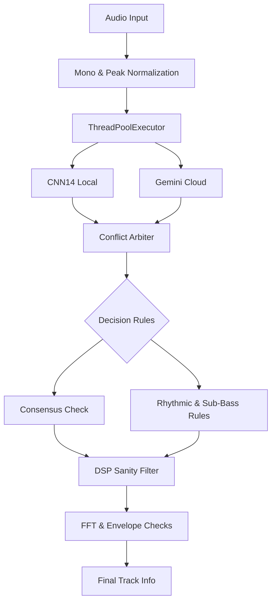

<div align="center">
  

  [](LICENSE)
  [](https://github.com/pontojasko/ReaperAiNOMEATOR/stargazers)
  [](https://github.com/pontojasko/ReaperAiNOMEATOR/issues)

  **Have you ever had to export stems from your FL Studio or Ableton project into Reaper, only to find yourself dreading the tedious process of organizing and renaming dozens of messy tracks?**

  Automatically identify, rename, and colorize your Reaper tracks using AI

  [Getting Started](#getting-started) · [Architecture](#architecture--features) · [Report Bug](https://github.com/pontojasko/ReaperAiNOMEATOR/issues)

  <br />
  
  <br />
  <em>Demo — names, colors and icons applied automatically by AI</em>
</div>

---

## Overview

> [!WARNING]
> **Note:** This is an experimental project. The AI models under the hood can still make mistakes. We warmly welcome any suggestions, feedback, or pull requests to help improve the classification pipelines!

Exporting stems from modern DAWs or receiving poorly named tracks from clients usually means spending hours manually renaming, coloring, and organizing the session before you can even start mixing.

AI Nomeator offloads this heavy lifting to a background AI processor. By utilizing a hybrid model approach (combining local CNNs and cloud-based Gemini), it accurately identifies the instruments playing in each stem and automatically organizes your entire Reaper project.

A fully structured, color-coded, and properly named Reaper session ready for mixing in minutes, saving you hours of tedious administrative work.

---

## Getting Started

Follow these steps to get AiNOMEATOR running in your Reaper environment.

### Prerequisites

- **Reaper** installed and configured.
- **Python 3.9+** installed and added to your system PATH.
- **Gemini API Key** from Google AI Studio.
- *(Optional)* SWS Extension for color synchronization.

### Installation

> [!IMPORTANT]
> Em ambas as opções de instalação (A ou B), você **DEVE** clonar ou baixar o repositório completo do GitHub para obter a pasta `src` (com o backend em Python) e o instalador `setup.bat`. O ReaPack sozinho baixa apenas os scripts `.lua`.

**Option A: ReaPack (Recommended)**
1. Clone ou baixe este repositório completo e coloque na pasta de scripts do Reaper (geralmente sob `Scripts/AiNOMEATOR/`).
2. No Reaper, vá em **Extensions > ReaPack > Manage repositories**.
3. Clique em **Import a repository** e cole a URL:
   ```text
   https://raw.githubusercontent.com/pontojasko/ReaperAiNOMEATOR/main/index.xml
   ```
4. Clique em **OK**, depois em **Synchronize packages**.
5. Busque por **AiNOMEATOR** no navegador do ReaPack e instale-o.

**Option B: Manual Installation**
1. Clone ou baixe este repositório para uma pasta local (de preferência em `Scripts/AiNOMEATOR/` dentro do diretório de recursos do Reaper).
2. Adicione o arquivo `AiNOMEATOR.lua` à sua lista de Actions do Reaper (**Actions > Show action list > New action > Load ReaScript**).

### Configuration

Você precisa configurar o ambiente virtual do Python e a chave de API do Gemini antes de rodar o script:

1. Vá até a pasta onde você clonou/baixou este repositório (ex: `Scripts/AiNOMEATOR/`).
2. Execute o arquivo `setup.bat`. Ele criará o ambiente virtual (`venv`) e instalará automaticamente todas as dependências necessárias (incluindo PyTorch, PANNs e a biblioteca do Gemini).
3. Abra o arquivo `.env` gerado na pasta raiz do projeto e insira sua chave de API do Gemini:

```env
GEMINI_API_KEY=your_api_key_here
```
---

## Usage

Once installed and configured, run the **AiNOMEATOR** script from your Reaper Actions list.

### Best Practices

To get the most accurate and fastest results, we strongly recommend the following settings in the GUI:

- **Analysis Backend**: Start with **Hybrid Heuristic** as your baseline, as it is generally the most accurate mode. It runs a local CNN14 (PANNs) model and cloud Gemini in parallel. However, since the optimal backend can vary based on the specific music genre and personal preferences, you are encouraged to experiment with different backends to find what works best for your workflow.
- **Analysis Mode**: Use **Detailed** only for best results.
- **Sort Tracks**: Enable this to automatically group and sort your tracks by instrument family.
- **Parallel Tracks**: Keep the thread count low (`1` or `2`) to avoid Gemini rate limits.

---

## Architecture & Features

The recommended **Hybrid Heuristic** backend relies on a triple-layer logic to prevent AI hallucinations and misclassifications:



1. **Parallel Execution Layer**: Both CNN14 and Gemini run concurrently, providing both spectral and semantic classification models in memory before making a decision.
2. **Conflict Arbiter**: 
   - *Rhythmic Priority*: If CNN14 detects a vocal but Gemini detects a shaker, the Arbiter overrides to shaker (Gemini excels at identifying high-frequency fricatives).
   - *Bass Transient*: If Gemini detects a piano but CNN14 detects bass or strings, it is classified as a bass (CNN14 recognizes low-frequency bodies better).
3. **DSP Sanity Filter**: Runs FFT and envelope checks locally.
   - Blocks vocal/piano tags if the main energy concentration is below 100Hz, forcing a bass/kick classification.
   - Forces a percussion classification if the sound has abrupt decays and no sustain.

### Audio Processing

Audio is locally converted to mono, peak-normalized, reduced to a higher-energy segment, and resampled to 24 kHz (or 16/32 kHz depending on the local model) before any AI processing occurs. This ensures low latency, reduced costs, and minimal context noise.

### Color Customization & SWS Sync

Edit `colors.ini` manually (format `key = #HEX`) or use the color prompt field in the GUI to generate a palette via AI. The AI-generated file is saved as `colors_prompt.ini`.
If you use the **SWS Extension**, run `AiNOMEATOR_sws_sync.lua` in Reaper (or `sync_sws_colors.bat` outside) to instantly copy the AiNOMEATOR palette to Reaper's native `sws-autocoloricon.ini`.

### File Architecture

```text
reaper-ainomeator/
├── AiNOMEATOR.lua              # Reaper GUI + result application
├── AiNOMEATOR_sws_sync.lua     # ReaScript shortcut for SWS color sync
├── setup.bat                   # Creates virtual env and .env file
├── sync_sws_colors.bat         # CLI shortcut for SWS color sync
├── colors.ini                  # Default color palette
├── src/                        # Processing backend in Python
└── tests/                      # Automated test scripts
```

---

## Troubleshooting

> [!NOTE]
> If Reaper reports no results, ensure that `setup.bat` was run, the `.env` file exists with your key, and Python is accessible in your PATH.

- **503 / 429 Errors**: Gemini might return temporary rate limit errors. Reduce the parallel threads setting in the GUI.
- **Invalid Python Path**: Ensure you restart Reaper or your computer after adding Python to your system PATH.
