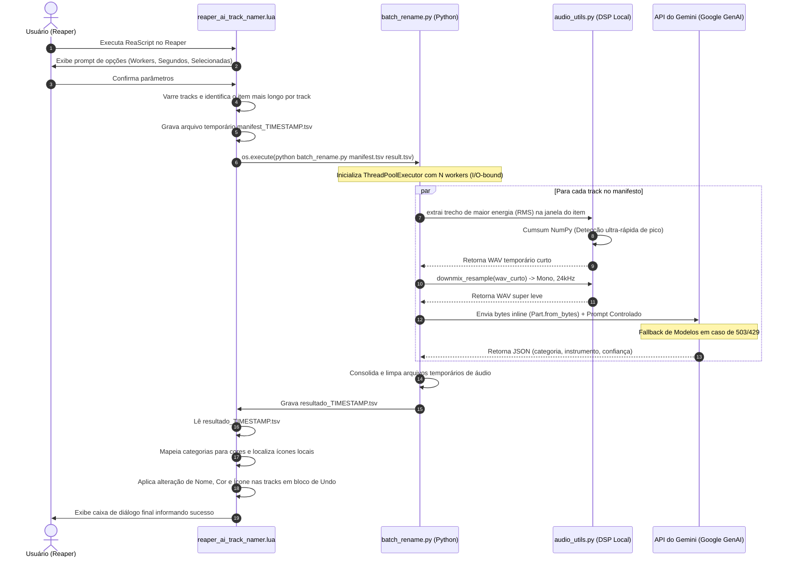

# Reaper AI Track Namer — Arquitetura Completa e Contexto Técnico

Este documento fornece uma descrição detalhada de toda a arquitetura, decisões de design, fluxos de dados e estratégias de IA adotadas no projeto **Reaper AI Track Namer**. Ele foi estruturado para servir de guia de contextualização definitivo para desenvolvedores e próximas IAs que precisem modificar, estender ou dar manutenção neste sistema.

---

## 1. Intenção do Projeto (Visão Geral)

O **Reaper AI Track Namer** resolve um problema comum no fluxo de trabalho de engenheiros de áudio e produtores musicais: a organização e identificação manual de dezenas (às vezes centenas) de faixas (*tracks*) de áudio brutas em sessões de gravação multitrack no **Cockos Reaper** (DAW).

### O Problema:
- Faixas sem nome ou com nomes genéricos gerados pela gravação (ex: `Audio_01.wav`, `Take_05.wav`).
- Perda de tempo colorindo e atribuindo ícones manualmente para distinguir vocais, guitarras, baterias e baixos.
- Dificuldade em rodar processamento pesado de IA ou bibliotecas complexas de Python de dentro do Reaper, devido às limitações do interpretador Lua interno (ReaScript) e travamentos da interface do usuário (UI).

### A Solução:
Uma arquitetura híbrida e desacoplada:
1. **Frontend Leve (ReaScript em Lua):** Roda na DAW, coleta os dados da sessão, gera um arquivo de manifesto e renderiza a saída final.
2. **Backend de Alta Performance (Python):** Executa processos pesados de leitura de áudio, processamento de sinais digitais (DSP) local, requisições de API de IA em paralelo e controle de falhas de forma assíncrona.
3. **IA (Google Gemini API):** Classifica o tipo de instrumento com base nos trechos mais significativos de áudio de cada faixa.

---

## 2. Arquitetura do Sistema e Estrutura de Arquivos

O projeto é dividido em camadas de responsabilidade bem definidas:

```
reaper-ai-namer/
├── reaper_ai_track_namer.lua  # UI & Integração DAW: varre tracks, gera manifest, chama Python e aplica resultados
├── batch_rename.py            # Orquestrador Batch: lê manifest, coordena Threads e grava resultados em TSV
├── classify_track.py          # Interface com IA: prompt, controle de fallbacks de modelos e chamada ao Gemini
├── audio_utils.py             # Processador DSP Local: RMS por cumsum (janelamento) e downmix/resample mono 24kHz
├── test_batch.py              # Suite de Validação: calcula acurácia contra um gabarito local sem passar pelo Reaper
├── requirements.txt           # Dependências Python (numpy, soundfile, google-genai, python-dotenv)
├── setup.bat                  # Script de Setup: inicializa venv, instala dependências e cria .env template
├── test_single.bat            # Teste Unitário Rápido: executa classify_track em um único arquivo de áudio
├── test_batch.bat             # Atalho para executar test_batch.py
└── samples/                   # Pasta para áudios curtos de calibração do prompt e testes locais
```

### Diagrama de Fluxo de Dados e Controle

O fluxo abaixo descreve a comunicação entre a DAW, o sistema de arquivos local, o pipeline Python e a API do Gemini:



---

## 3. Detalhamento Técnico dos Módulos

### 3.1. [audio_utils.py](file:///c:/Users/jasko/Downloads/reaper-ai-namer/audio_utils.py) — Processamento DSP Local
Para evitar o envio de arquivos gigantescos e conter custos com a API, este módulo executa duas otimizações cruciais:

1. **Seleção de Janela de Maior Energia (RMS):**
   - **Problema:** Um *stem* de áudio de 5 minutos pode ter silêncio absoluto no início/fim ou trechos onde o instrumento não toca (ex: guitarra que só entra no refrão).
   - **Solução:** O script lê o arquivo e calcula a soma de energia quadrada ($mono^2$) usando soma cumulativa (`np.cumsum`).
   - O uso de `cumsum` permite calcular o RMS de qualquer sub-janela de $N$ segundos em tempo complexidade $O(1)$ após o setup de $O(T)$, o que é incrivelmente rápido mesmo para arquivos muito longos.
   - O algoritmo seleciona a janela com maior energia dentro dos limites do item do Reaper.
2. **Resampling e Downmix:**
   - Converte o áudio para **Mono** e faz o resample por interpolação linear simples para **24kHz** (PCM 16-bit).
   - Um trecho padrão de 8 segundos convertido neste formato pesa apenas **~384KB** (ao invés de dezenas de megabytes de um arquivo WAV estéreo de 48kHz).
   - Isso permite enviar o áudio inline na requisição, minimizando a latência de tráfego.

### 3.2. [classify_track.py](file:///c:/Users/jasko/Downloads/reaper-ai-namer/classify_track.py) — Motor de Classificação e Lógica de IA
Este arquivo encapsula o acesso à API do Google Gemini (`google-genai` SDK v2).

1. **Vocabulário Fechado:**
   - Para evitar respostas semânticas inconsistentes (ex: `"violão de nylon"`, `"acoustic guitar"`, `"guitar-like synth"`), o prompt força o modelo a classificar o áudio em uma de 9 categorias estritas:
     `CATEGORIAS_VALIDAS = ["vocal", "guitarra", "baixo", "bateria", "teclado", "synth", "sopro", "cordas", "outro"]`
   - O nome específico do instrumento (ex: `"baixo fretless"`) é livre e devolvido no campo `instrument` para dar flexibilidade ao nome da track.
2. **Robustez a Erros e Fallback Chain:**
   - O Google frequentemente descontinua ou atualiza modelos, e a API gratuita é sujeita a erros `503 Service Unavailable` e `429 Rate Limit`.
   - Para mitigar isso, foi implementado o `MODELOS_FALLBACK = ["gemini-3.5-flash", "gemini-3.1-flash-lite", "gemini-2.5-flash"]`.
   - Se uma requisição falhar por erro transitório, o código tenta repetir $N$ vezes com backoff exponencial. Se o erro persistir, ele **salta para o próximo modelo** da cadeia.
   - Se o modelo retornar um conteúdo inválido que não seja um JSON legível, o parser falha e o script pula para o modelo reserva imediatamente.

### 3.3. [batch_rename.py](file:///c:/Users/jasko/Downloads/reaper-ai-namer/batch_rename.py) — Orquestrador Paralelo
Esse script é o ponto de entrada do backend Python para múltiplas tracks.

1. **ThreadPoolExecutor:**
   - Como as requisições à API de IA são operações limitadas por I/O de rede (*I/O-bound*), o script utiliza threads em vez de processos (`multiprocessing`), economizando overhead de CPU.
   - Ele gerencia o ciclo de vida dos arquivos temporários de áudio criados em lote. A limpeza é feita no bloco `finally` para garantir que o disco não encha de arquivos `.wav` temporários se uma thread quebrar.
2. **SharedModelList (Fallback Global de Modelo):**
   - Para evitar que múltiplos requests tentem usar um modelo sobrecarregado (ex: `gemini-3.5-flash`) e falhem ou sofram timeout individualmente, implementou-se um gerenciador de modelos compartilhado de forma *thread-safe*.
   - Assim que **qualquer thread** esgota as tentativas ou falha com um modelo na API do Gemini, o modelo falho é imediatamente removido da lista global compartilhada.
   - Consequentemente, todas as outras faixas do lote que ainda não iniciaram a chamada de rede ou as próximas faixas da fila usarão diretamente o próximo modelo de fallback (ex: `gemini-3.1-flash-lite`), economizando tempo e evitando gargalos em lote.

### 3.4. [reaper_ai_track_namer.lua](file:///c:/Users/jasko/Downloads/reaper-ai-namer/reaper_ai_track_namer.lua) — Ponte com a DAW
O script em Lua roda dentro do Reaper e realiza o seguinte fluxo:

1. **Análise de Contexto:**
   - Varre as faixas e identifica qual arquivo físico está tocando. Se a faixa contiver múltiplos itens cortados (ex: edições), ele descobre qual item tem a maior duração na linha do tempo e usa as coordenadas de *offset* (`D_STARTOFFS`) e duração do item para extrair a janela correta do arquivo fonte.
2. **Geração de Manifestos e Retorno:**
   - Escreve um arquivo temporário no formato TSV (Tab-Separated Values). Esse formato foi escolhido por ser extremamente simples de parsear em Lua pura, sem requerer dependências complexas de parser JSON externas.
3. **Escrita da Configuração da Track:**
   - O script atribui o novo nome do instrumento.
   - Ele pinta a faixa de acordo com a paleta de cores definida em `COLORS`.
   - Ele busca nos ícones padrão do Reaper (`Data/track_icons`) usando substrings correspondentes a cada categoria (`ICON_KEYWORDS`) e ativa o ícone adequado.
   - Executa todas as ações dentro de um bloco de transação do Reaper (`Undo_BeginBlock` / `Undo_EndBlock`), permitindo que o usuário desfaça toda a operação com um único `Ctrl+Z`.

---

## 4. Guia de Manutenção e Evolução (Para Futuras IAs)

Se você é um agente de IA encarregado de dar manutenção ou adicionar recursos a este repositório, atente-se às seguintes diretrizes técnicas:

### 4.1. Preservação de DSP Local
- **Nunca remova a lógica de downsampling ou corte de energia RMS.** Tentar enviar stems inteiros de 5 minutos diretamente para a API causará estouro de timeout, aumento massivo na latência e custos de processamento elevados.
- Se for implementar suporte a formatos adicionais, note que `soundfile` depende de `libsndfile` do sistema. O script possui um fallback automático que chama o comando `ffmpeg` caso `soundfile` apresente erro de leitura. Se você for alterar a forma como arquivos MP3/M4A são lidos, certifique-se de manter essa tolerância de fallbacks.

### 4.2. Manutenção do Prompt e Vocabulário
- Se o usuário reportar que a acurácia de identificação de faixas está ruim, o ajuste deve ser feito **estritamente no prompt** dentro de [classify_track.py](file:///c:/Users/jasko/Downloads/reaper-ai-namer/classify_track.py) ou nos exemplos locais, nunca alterando o fluxo de dados em si.
- Se for adicionar uma nova categoria em `CATEGORIAS_VALIDAS`, lembre-se de atualizar:
  1. O prompt do Gemini (`PROMPT` em `classify_track.py`).
  2. A tabela de cores (`COLORS` em `reaper_ai_track_namer.lua`).
  3. A tabela de mapeamento de ícones (`ICON_KEYWORDS` em `reaper_ai_track_namer.lua`).
  4. O gabarito de testes em `test_batch.py` se necessário.

### 4.3. Gerenciamento de Rate Limits e Erros da API
- O modelo padrão é `gemini-3.5-flash`. Ele é altamente responsivo.
- Se o Reaper enviar 30 faixas simultâneas com `--workers 10`, a API pode responder com `429 (Resource Exhausted)`. O loop de retry em `classify_audio_bytes` lida com isso, mas caso ocorram falhas frequentes nas threads, recomende ao usuário reduzir a quantidade de threads paralelas na caixa de diálogo inicial do ReaScript (ex: baixar de 5 para 3).

### 4.4. Testes Locais
Antes de liberar modificações no prompt de classificação ou no DSP de corte, valide localmente:
1. Coloque amostras conhecidas em `samples/`.
2. Configure o dicionário `GABARITO` em `test_batch.py`.
3. Rode `test_batch.bat` para garantir que as alterações não introduziram regressão na acurácia geral do modelo.

---

## 5. Contrato de Comunicação (Formatos de Entrada/Saída)

### Manifesto de Entrada (gerado pelo Lua, lido pelo Python):
```tsv
idx	caminho_do_audio	inicio_segundos	duracao_segundos
0	C:\Sessoes\Musica1\Vocal.wav	10.500	120.300
1	C:\Sessoes\Musica1\Gtr.wav	0.000	150.000
```
*(Valores em tab-separated. Se os tempos não forem definidos, o Python assume o arquivo de áudio inteiro).*

### Arquivo de Resultados (gerado pelo Python, lido pelo Lua):
```tsv
idx	status	categoria	instrumento	confianca	erro
0	ok	vocal	vocal principal	0.95	
1	erro				arquivo nao encontrado: Gtr.wav
```
*(Garante que falhas individuais de faixas não interrompam a classificação de outras faixas na DAW. O campo de erro deve ter suas tabulações e quebras de linha removidas para evitar quebras de parsing no Lua).*
