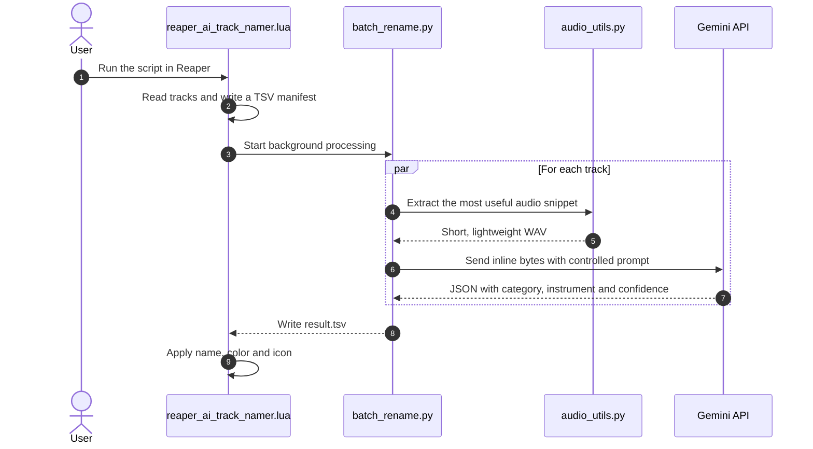

<p align="center">
  
</p>

# Reaper AI Track Namer

Automatically identifies the primary instrument of each track in Reaper using Gemini, then applies a name, color and icon with a lightweight flow that keeps the DAW responsive.

> [!NOTE]
> The project is split into two stages: local AI validation via Python and final integration with Reaper via ReaScript. First tune classification in the terminal; then bring the pipeline into the DAW.

## Overview

The flow is simple:



The pipeline prioritizes short, representative snippets to reduce cost, latency and context noise. Audio sent to the API is locally reduced to a higher-energy segment, converted to mono and resampled to 24 kHz before the request.

## Key features

- Single-file or batch audio classification.
- Reaper integration without blocking the UI.
- Parallelism using `ThreadPoolExecutor` for API calls (I/O-bound).
- Automatic Gemini model fallback when a model fails or becomes unavailable.
- Standardized TSV output to ease exchange between Lua and Python.
- Local validation tools with `test_single.bat` and `test_batch.bat` before using inside the DAW.

## Requirements

- Windows
- Python 3.9+ in PATH
- A Gemini API key
- Reaper for the integration step with `reaper_ai_track_namer.lua`

> [!TIP]
> If you only want to test the AI first, you don't need to open Reaper. Use `classify_track.py` and `test_batch.py` with the sample files in `samples/`.

## Installation

1. Extract the repository to a local folder, e.g. `C:\reaper-ai-namer`.
2. Run `setup.bat`.
   - It creates the virtual environment.
   - It installs dependencies.
   - It creates a `.env` file at the project root.
3. Open `.env` and set your key:

```env
GEMINI_API_KEY=put_your_key_here
```

## Quick start

### 1. Test a single audio file

Use `test_single.bat` with a short audio file, or run directly:

```bash
python classify_track.py "C:\path\to\audio.wav"
```

By default the script looks for an 8-second segment of highest energy in the file, converts that segment into a lightweight version and only then sends the bytes to Gemini.

Useful options:

- `--full`: analyze the entire file (usually only for comparison).
- `--segment-seconds N`: set the length of the analyzed segment.
- `--keep-segment`: keep temporary WAVs for inspection.
- `--models a,b,c`: set the model fallback order.

### 2. Validate in batch

Put samples in `samples/`, fill the `GABARITO` in `test_batch.py` and run `test_batch.bat`.

This step shows whether the prompt is consistent. If accuracy is poor, adjust the prompt in `classify_track.py` or the optional `analysis_prompt.txt` file.

### 3. Run inside Reaper

In Reaper, load `reaper_ai_track_namer.lua` as a ReaScript:

1. `Actions > Show action list...`
2. `New action... > Load ReaScript...`
3. Select `reaper_ai_track_namer.lua`

When executed, the UI provides these default options:

- Analyze all tracks or only the selected ones.
- Detailed mode by default, with more conservative audio extraction.
- `8` seconds of analysis per track.
- `5` parallel threads.

The script prefers the venv Python first. If the venv is missing, it falls back to the system Python and shows warnings in the Reaper console.

## How it works

### Step 1: Reaper gathers context

The ReaScript scans project tracks, finds the most representative media item and writes a TSV manifest with:

```tsv
idx	audio_path	start_seconds	duration_seconds
```

MIDI, empty tracks or tracks without an audio source are ignored.

### Step 2: Python processes and calls the AI

`batch_rename.py` reads the manifest, distributes tracks across threads and calls `classify_track.py` / `classify_audio_bytes` for each entry. The result returns in another TSV:

```tsv
idx	status	category	instrument	confidence	error
```

`status` can be `ok` or `error`. If something fails, the rest of the batch continues processing.

### Step 3: Reaper applies the result

After reading the TSV, the script:

- renames the track;
- applies a coherent color per category;
- attempts to find a matching icon among Reaper's native icons.

## Analysis modes

The backend supports two main paths:

- **Quick mode**: combines three energy peaks into a lightweight MP3 at 128 kbps.
- **Detailed mode**: removes silences and sends a more faithful WAV.

These modes balance speed and robustness depending on the session.

## File architecture

```text
reaper-ai-namer/
├── reaper_ai_track_namer.lua   # Reaper integration
├── batch_rename.py             # Batch processing and orchestration
├── classify_track.py           # Classification with Gemini
├── audio_utils.py              # Snippet extraction, cleanup and resampling
├── test_batch.py               # Local validation with answer key
├── setup.bat                   # Creates venv and .env
├── test_single.bat             # Single-audio test
├── test_batch.bat              # Batch test
├── analysis_prompt.txt         # Optional prompt to calibrate the AI
├── ainomeator_logo.png         # Project logo
└── samples/                    # Test audio files
```

## Troubleshooting

> [!IMPORTANT]
> `503`, `429` errors or model renames are expected from time to time in the Gemini ecosystem. The project attempts to work around these with fallback and retries, but you may still need to adjust model order in `classify_track.py` or via `--models`.

Common issues:

- `GEMINI_API_KEY not found`: `.env` was not edited.
- `403` or `PERMISSION_DENIED`: the key is invalid or the API is not enabled.
- `file not found`: the audio path is incorrect.
- Invalid response: test the file with `--keep-segment` and review the prompt.
- Batch failures due to rate limit: reduce `threads` in Reaper.

If Reaper reports no result, check in this order:

1. `setup.bat` was run.
2. `.env` exists and contains the key.
3. Python is accessible.
4. The audio file actually exists.

## Technical notes

- Audio sent to Gemini is reduced locally before the call.
- Categories are kept in a closed vocabulary to avoid semantic drift.
- The pipeline uses simple TSV files on both sides to ease integration without extra Lua dependencies.
- `ffmpeg` is used as fallback when `soundfile` cannot read the original format.

## Useful next steps

1. Run `test_single.bat` with a known file.
2. Validate a batch with `test_batch.bat`.
3. Load `reaper_ai_track_namer.lua` in Reaper and test on a small session.
